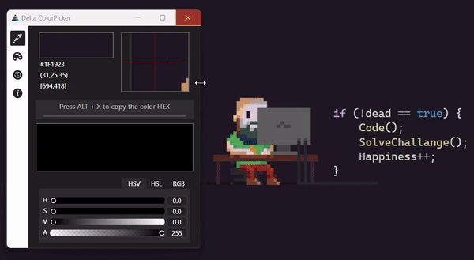

# DeltaColorPicker
DeltaColorPicker is a Windows desktop application that simplifies color selection for designers and developers. With DeltaColorPicker, you can easily capture any color from any pixel on your screen and integrate it with a custom colorpicker. This application is perfect for anyone who needs to work with colors on a regular basis, whether it's designing web pages, creating graphics, or developing software.

## Features
• Simple and intuitive user interface  
• Easy color capture from anywhere on your screen  
• Custom colorpicker with RGB and HEX values  
• Lightweight and fast performance  
• Compatible with Windows 8/10/11  

## Installation
To install DeltaColorPicker, simply follow these steps:
1. Go the latest release on GitHub.
2. Click on on "DeltaColorsPicker.exe" to install it.
3. Run the "DeltaColorPicker.exe" file to start the application.
###### A warning may pop up, because the app is not signed with a certificate. Click on "More info" --> "Run anyway". Nothing to worry about, you can view the source code :)

## Usage
To use DeltaColorPicker, follow these simple steps:
1. Click on the "Capture Color" icon button to capture the color of any pixel on your screen.
2. Hover with your mouse at any pixel at your screen and clock "ALT + X" to capture the color and dave it.
3. You can Use the custom colorpicker to adjust the color.

